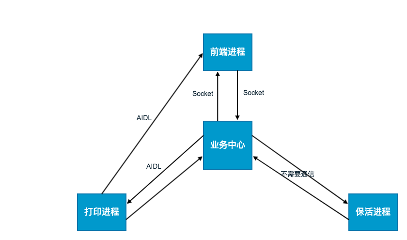

# android 中的 进程，多进程。

#### 1、进程特性
系统进行资源分配和调度的基本单位

#### 2、认识方式
和线程做对比，进程和线程的主要差别在于它们是不同的操作系统资源管理方式。进程有独立的地址空间，一个进程崩溃后，在保护模式下不会对其它进程产生影响，而线程只是一个进程中的不同执行路径。线程有自己的堆栈和局部变量，但线程之间没有单独的地址空间，一个线程死掉就等于整个进程死掉，所以多进程的程序要比多线程的程序健壮，但在进程切换时，耗费资源较大，效率要差一些。

单个进程崩溃，不会影响其他进程，
每个进程分配的内存是有限的，使用多进程分担主进程的内存消耗。
进程多了 ，就需要管理，  一般的套路就是优先级来实现进程管理。

#### 3、应用，
（1）多进程间的通信（站在设计者角度去理解）
难点进程进数据不共享：用户空间，共享空间
android系统提供的方案：**binder机制**  
衍生封装使用：android接口定义语言（AIDL），Messenger

（2）Android 中binder实现原理
c/s框架模型，需要服务端注册，客户端获取。
一次通信过程：拿到服务端代理，客户端发起调用请求，通过代理从用户空间拷贝数据 到内核空间（方法一一映射），找到真实服务端实例，调用方法，得到结果，再原路返回。

实现进程间数据访问（数据不共享）， 用户空间，内核空间  一一映射，数据拷贝。

多任务情况 ，队列处理

三种对比：AIDL ， Messenger ， socket 。
AIDL ：封装Binder，提供简易流程，基本实现，.aidl 文件很重要，就像接口文档一样，服务端开放实现的接口，客户端参照调用。 如果是跨应用，需要根据这个文档定义接口协议，服务端通过多线程去接受请求，可以处理**并发请求**，这里就是跟Messenger的区别

Messenger
使用更加简易，AIDL 的简化版，它把接口都封装好
[通用接口文件](http://book2s.com/java/src/package/android/os/imessenger.html)
Message message = Message.obtain();
message.arg1 = BinderType.MSG_EXCUTE;
message.what = BinderType.CLIENT_TYPE_EXCUTE;
message.replyTo = msnClient;
1、可以实现消息反馈message.replyTo
2、不要在主线程里做费时操作，

技术选型：
根据他们的特性来做出选择：业务简单不需要实现并发请求的，可以使用Messenger，简单方便。 其它可以参考下AIDL使用。

(3)进程包活
包活方式 1、死后拉活，2、提高优先级

#### 4、实际使用注意
1. Application 的多次调用。
2. 进程关闭前先保存或者释放后背工作。
3. 应用启动
一般进程的承载这为四大组件中的Service、BroadcastReceiver标记不同进程方法：android:process=":bizcenter"，一些项目实践方案。
一些项目实践
启动过程：

通信：

参考：
[https://developer.android.com/guide/components/aidl?hl=zh-cn](https://developer.android.com/guide/components/aidl?hl=zh-cn)

[https://developer.android.com/guide/components/bound-services?hl=zh-cn](https://developer.android.com/guide/components/bound-services?hl=zh-cn)

[http://gityuan.com/2015/10/31/binder-prepare/](http://gityuan.com/2015/10/31/binder-prepare/)

[https://www.jianshu.com/p/04a034cbbc27](https://www.jianshu.com/p/04a034cbbc27)