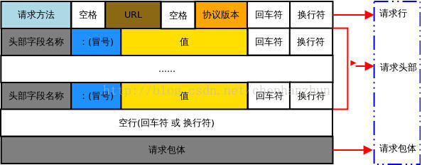
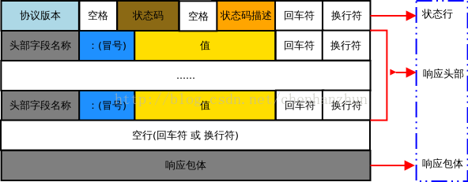

# android 中的网络通信。

### http 基础
应用层面向对象的协议
特点：简单、灵活、无连接、无状态、C/S。
内容：
请求：



```
    POST /meme.php/home/user/login HTTP/1.1
    Host: 114.215.86.90
    Cache-Control: no-cache
    Postman-Token: bd243d6b-da03-902f-0a2c-8e9377f6f6ed
    Content-Type: application/x-www-form-urlencoded
    
    tel=13637829200&password=123456
```

响应：



```
    HTTP/1.1 200 OK
    Date: Sat, 02 Jan 2016 13:20:55 GMT
    Server: Apache/2.4.6 (CentOS) PHP/5.6.14
    X-Powered-By: PHP/5.6.14
    Content-Length: 78
    Keep-Alive: timeout=5, max=100
    Connection: Keep-Alive
    Content-Type: application/json; charset=utf-8

    {"status":202,"info":"\u6b64\u7528\u6237\u4e0d\u5b58\u5728\uff01","data":null}

```

### 知识点
#### android中的封装API

1. HttpClient（2.2及之前）：
   Google表示不想维护，兼容性差、不易扩展、效率相对低。 但是稳定。
2. HttpURLConnection（2.3）：
   官方一直在维护更新，后面版本做的一些事情：响应压缩、会话重试、缓存～～
  
总的来说 这些是Google对http协议的一层封装，方便调用，而后的很多开源库又是在这基础上进行封装。

#### http缓存

#### okhttp开源框架


https://www.jianshu.com/p/3141d4e46240
