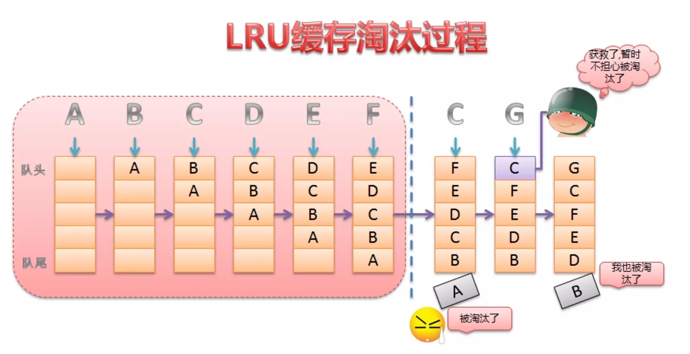
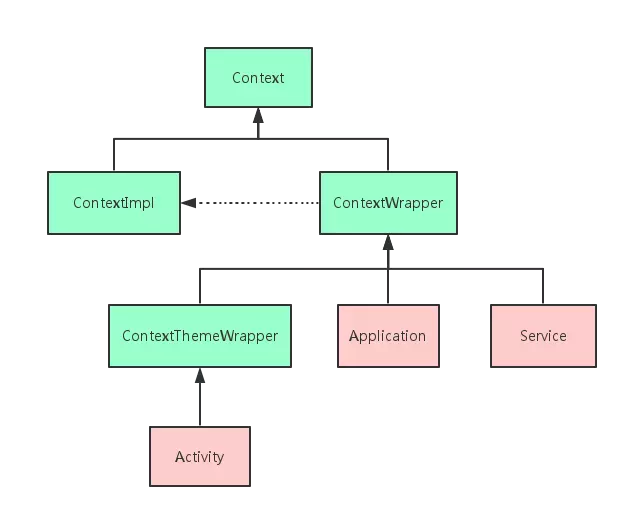
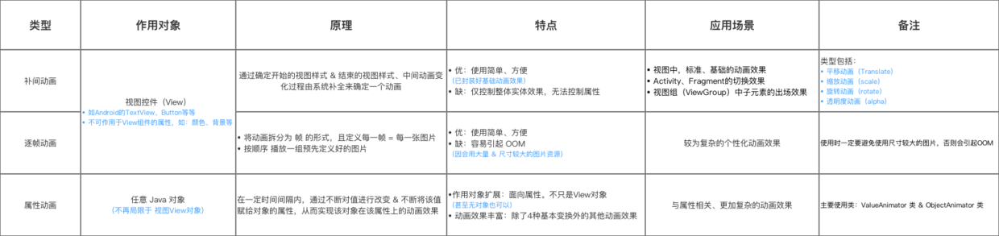

# Android基础

#### LruCache （最近最少使用算法）

解决的问题：
在Android缓存这块，因为内存空间是有限的，不断的加入数据，迟早会到达最大值，LrhCache就是要解决这个问题的。

方案：
android提供API：LrhCache和DisLruCache

内容原理：
核心原理在于怎么实现删除过期数据。
LrhCache的实现使用了LinkedHashMap的特性，它可以做到按访问顺序排序，将最近访问过的放在最前面，一直没访问的对象，将放在队尾，即将被淘汰。

LinkedHashMap是由数组+双向链表的数据结构来实现的。其中双向链表的结构可以实现访问顺序和插入顺序，使得LinkedHashMap中的<key,value>对按照一定顺序排列起来。

双向链表：
也叫双链表，是链表的一种，它的每个数据结点中都有两个指针，分别指向直接后继和直接前驱。所以，从双向链表中的任意一个结点开始，都可以很方便地访问它的前驱结点和后继结点

应用：
Android中的三级缓存。

#### ConstraintLayout

相对定位：constraint
边距：margin
连接到GONE小部件时的边距:goneMargin(订单详情可以用用)
居中定位
偏差：constraintHorizontal_bias
循环定位：Circle
尺寸限制ConstraintLayout上的最小尺寸：min、max
使用0dp，相当于“ MATCH_CONSTRAINT”
防止约束失效:app:layout_constrainedWidth=”true” ,app:layout_constrainedHeight=”true”
链:

注意：您不能在约束中具有循环依赖关系。

##### android server
1. 生命周期：onCreate、onStartCommand、onDestroy （onBind、onUnbind）
2. 启动：bindserver \ startServer

##### BroadCast Receive
动态注册：
静态注册：

##### 横竖屏切换时候Activity的生命周期
onSaveInstanceState

onSaveInstanceState()的调用遵循一个重要原则，即当系统存在 “未经你许可” 销毁了我们的 activity 的可能时，则 onSaveInstanceState() 会被系统调用，这是系统的责任，因为它必须要提供一个机会让你保存你的数据。且调用将发生在 onPause() 之前

android:configChanges(orientation|screenSize)

android:screenOrientation

##### Activity与Fragment之间生命周期比较
onAttach \ onDetach

onCreateView \ onDestroyView

##### service和activity怎么进行数据交互
1. bindService.  ServiceConnection ,返回service对象，
2. bus
3. broadCast

##### Dialog和PopUpWindow、DidlogFragment
1. AlertDialog是非阻塞式对话框：AlertDialog弹出时，后台还可以做事情；而PopupWindow是阻塞式对话框：PopupWindow弹出时，程序会等待，在PopupWindow退出前，程序一直等待，只有当我们调用了dismiss方法的后，PopupWindow退出，程序才会向下执行。

2. 这两种区别的表现是：AlertDialog弹出时，背景是黑色的，但是当我们点击背景，AlertDialog会消失，证明程序不仅响应AlertDialog的操作，还响应其他操作，其他程序没有被阻塞，这说明了AlertDialog是非阻塞式对话框；PopupWindow弹出时，背景没有什么变化，但是当我们点击背景的时候，程序没有响应，只允许我们操作PopupWindow，其他操作被阻塞。

3. 官方推荐DidlogFragment
生命周期、旋转屏幕和按下后退键管理其生命周期、DialogFragment可以把Dialog作为内嵌的组件。

##### Application 和 Activity 的 Context 对象
作用域：Activity的作用域大继承自 ContextThemeWrapper

Context  -  ContextWrapper  -  ContextThemeWrapper

##### Context的重要性
一般的Java类可以 new对象，但是像Android中的Context实现类new出来的话，生命周期用不了。

##### 如何导入外部数据库
1. 好处：可以初始化一些数据，
2. 数据库存放位置：data/data/包名/databases，我们只需要用FileOutputStream写入到目录就行

##### RecycleView
1. 节藕、扩展， 对传统的列表控件优化使用
2. 优点：ViewHolder：布局复用， LayoutManager：自定义布局样式，分割线：自定义，动画：Item
3. onCreateViewHolder、onBindViewHolder。

##### Android中数据存储方式
三级存储

##### Android各个版本API的区别
- Android 9：室内定位、凹口屏幕的支持、消息通知的改进、多摄像头 API、神经网络 
- Android 8：后台进程限制、画中画、Notification Dots、运行时权限策略变化（权限组、明确请求的权限）
当应用被置入后台后，Android O将自动智能限制后台应用活动，主要会限制应用的广播、后台运行和位置，但应用的整体进程并没有被杀掉
- Android 7：通知栏快捷回复、VR、分屏多任务功能
- Android 6：运行时权限、Doze电量管理
- Android 5：Material design（UI风格）、CardView、RecycleView、支持64位系统
- Android 4：新锁屏界面、人脸识别解锁、全新通知栏

##### invalidate和postInvalidate

##### Bitmap 
图片内存：图片宽＊图片高*色彩格式占用字节数
不同资源目录下面计算不同
Options

##### drawable和mipmap文件夹存放图片的区别
mipmaps可以提高系统渲染图片的速度，提高图片质量，减少GPU压力

##### Android 动画

1. View Animation （视觉改变，属性为改变）
补间动画，逐帧动画：每一帧 一张图
2. Property 属性动画 （视觉、属性改变）
对View Animation的扩展补充。
在一段时间内，通过不断的赋值设置对象的属性，实现改变动画。
- 好处：作用对象扩展不止View，效果扩展

3. 插值器 & 估值器
实现规律变换

4. 硬件加速
将CPU要做的事情分配些给GPU绘制，  加速绘制刷新速度

cpu:绘制内容加载为像素，由Bitmap承载View，只要有view变化需要刷新父View，重绘

Gpu:当界面发生变化，只绘制新当前View。
区别：重绘刷新范围