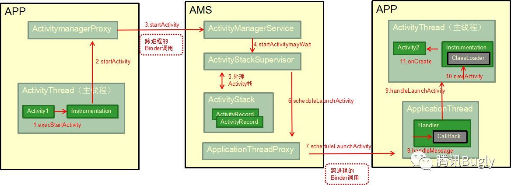
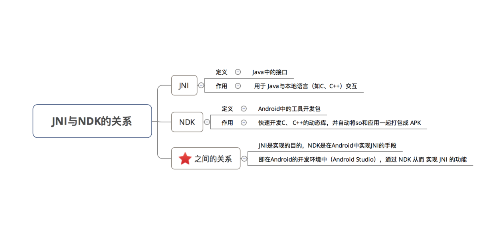

# Android中的插件化

#### 区分插件化和热修复：
技术|目的|难易度
---|:--:|---:
插件化|实现功能模块独立出来加载|相对简单
热修复|修复bug|实现复杂

#### 含义：
不必再像原来一样把所有的内容都放在一个apk中，分为宿主apk、插件apk。

- 宿主： 就是当前运行的APP
- 插件： 相对于插件化技术来说，就是要加载运行的apk类文件


#### 优点：
1. 热部署：需要什么功能加载什么功能
2. 模块化
3. 不发版本上新功能
4. 宿主小
5. 独立开发独立模块
6. bug修复（不建议）～～～～


#### 方案：
- 业务上：应用在运行的时候动态的加载一些可替换的执行文件实现一些特定的功能，
- 代码上：通过Android的ClassLoader类加载器加载外部dex文件（即插件）来实现一些特定的功能。
- 难点：1、加载Android四大组件，2、加载资源文件


#### 核心内容
##### 1、类加载器
虚拟机通过ClassLoader加载Jar文件并执行里面的代码，Android应用类似于Java程序，虚拟机换成了Dalvik/ART，而Jar换成了Dex，Android中大体两类

1. DexClassLoader可以加载jar/apk/dex，可以从SD卡中加载未安装的apk；
2. PathClassLoader只能加载系统中已经安装过的apk；

它们都继承与BaseDexClassLoader，里面核心加载类的过程代码

```
//加载类到内存流程上：先查看自身是否已经加载过该类，如果没有加载过会首先让父加载器去加载，如果父加载器无法加载该类时才会调用自身的findClass方法加载，该机制很大程度上避免了类的重复加载。

protected Class<?> loadClass(String className, boolean resolve) throws ClassNotFoundException {
        Class<?> clazz = findLoadedClass(className);

        if (clazz == null) {
            ClassNotFoundException suppressed = null;
            try {
                clazz = parent.loadClass(className, false);
            } catch (ClassNotFoundException e) {
                suppressed = e;
            }

            if (clazz == null) {
                try {
                    clazz = findClass(className);
                } catch (ClassNotFoundException e) {
                    e.addSuppressed(suppressed);
                    throw e;
                }
            }
        }

        return clazz;
    }
```

- 特点：如果一个类被位于树根的ClassLoader加载过，那么在以后整个系统的生命周期内，这个类永远不会被重新加载。（双亲代理）
作用：1、共享，不用多次加载。 2、隔离，防止自定义的类覆盖系统的类。

- 动态修复Bug的原理：加载一个新版本的dex文件，使用里面的新类替换原有的旧类，从而修复原有类的BUG，那么你必须保证在加载新类的时候，旧类还没有被加载。

- 加载成功后方法调用：
   1、反射， 2、接口（维护一套公共接口，类型转换）

##### 2、加载Android组件，资源
难点：

Android中许多组件类（如Activity、Service等）是需要在Manifest文件里面注册后才能工作的（系统会检查该组件有没有注册），所以即使动态加载了一个新的组件类进来，没有注册的话还是无法工作。Res资源是Android开发中经常用到的，而Android是把这些资源用对应的R.id注册好，运行时通过这些ID从Resource实例中获取对应的资源。如果是运行时动态加载进来的新类，那类里面用到R.id的地方将会抛出找不到资源或者用错资源的异常，因为新类的资源ID根本和现有的Resource实例中保存的资源ID对不上；

问题总结：

- 插件APK里的Activity的生命周期处理；
- 插件APK里的R资源加载使用；

技术|实现
---|:--:
第一代|代理
第二代|Hook系统服务
第三代|APP沙箱环境


方案1、绕行方案

Fragment代替Activity，这样可以最大限度得避开“无法注册新组件的限制”。 使用代码动态布局View代替XML文件。

方案2、代理Activity 

原理：主项目APK注册一个代理Activity（命名为ProxyActivity），ProxyActivity是一个普通的Activity，但只是一个空壳，自身并没有什么业务逻辑。每次打开插件APK里的某一个Activity的时候，都是在主项目里使用标准的方式启动ProxyActivity，再在ProxyActivity的生命周期里同步调用插件中的Activity实例的生命周期方法，从而执行插件APK的业务逻辑。  ProxyActivity + 没注册的Activity = 标准的Activity

AssetManager中的addAssetPath方法，我们可以将一个apk中的资源加载到Resources中，由于addAssetPath是隐藏api我们无法直接调用，所以只能通过反射，下面是它的声明，通过注释我们可以看出，传递的路径可以是zip文件也可以是一个资源目录，而apk就是一个zip，所以直接将apk的路径传给它，资源就加载到AssetManager中了，然后再通过AssetManager来创建一个新的Resources对象，这个对象就是我们可以使用的apk中的资源了，这样我们的问题就解决了。

```
protected void loadResources() {  
    try {  
        AssetManager assetManager = AssetManager.class.newInstance();  
        Method addAssetPath = assetManager.getClass().getMethod("addAssetPath", String.class);  
        addAssetPath.invoke(assetManager, mDexPath);  
        mAssetManager = assetManager;  
    } catch (Exception e) {  
        e.printStackTrace();  
    }  
    Resources superRes = super.getResources();  
    mResources = new Resources(mAssetManager, superRes.getDisplayMetrics(),  
            superRes.getConfiguration());  
    mTheme = mResources.newTheme();  
    mTheme.setTo(super.getTheme());  
}
```


缺点：

- 插件中的Activity必须继承PluginActivity，开发侵入性强。
- 如果想支持Activity的singleTask，singleInstance等launchMode时，需要自己管理Activity栈，实现起来很繁琐。
- 插件中需要小心处理Context，容易出错。
- 如果想把之前的模块改造成插件需要很多额外的工作。

开源框架[dynamic-load-apk](https://github.com/singwhatiwanna/dynamic-load-apk)

方案3、Hook 

简单的思路：在系统启动Android组件的流程上hook替换系统实现，以下是activity启动流行：



1. 先在Manifest中预埋StubActivity，启动时hook上图第1步，将Intent替换成StubActivity。
2. hook第10步，通过插件的ClassLoader反射创建插件Activity
3. 之后Activity的所有生命周期回调都会通知给插件Activity

开源框架[VirtualAPK](https://github.com/didi/VirtualAPK)

方案4、App沙箱环境 

在应用层构建了一个虚拟的app运行环境，实现了免安装运行apk，应用双开等黑科技。

#### 实际应用
业务场景：

1. 项目庞大希望独立功能分开开发，达到单独维护、打包、发布。
2. 有些应用角色不需要部分功能模块（这部分占用内存、性能高），可以作为插件。
3. 业务上不需要加载Android组件、资源文件。
4. 可以动态发布。

记录一些小细节～～～

- 插件APK的管理后台：服务器后台apk包管理
- 插件APK合法性校验：Android 提供API获取未安装APK的一些基本信息（PackageManager.getPackageArchiveInfo(String archiveFilePath, int flags)

- 版本控制：根据未安装APK的版本号和当前版本号对比。
- 加载apk中的java文件：继承DexClassLoader类重写loadClass。
- 加载apk中的资源文件：AssetManager类 addAssetPath方法。
- 插件apk中的方法调用：反射。


#### 积累点

1、加载的可执行文件一定要存放在内部存储

2、一个Android程序和标准的Java程序最大的区别就在于他们的上下文环境（Context）不同。Android中，这个环境可以给程序提供组件需要用到的功能，也可以提供一些主题、Res等资源

3、ClassLoader的动态加载技术（除了加载SO库外），使用ClassLoader的一个特点就是，如果程序不重新启动，加载过一次的类就无法重新加载。因此，如果使用ClassLoader来动态升级APP或者动态修复BUG，都需要重新启动APP才能生效。

4、除了使用ClassLoader外，还可以使用jni hook的方式修改程序的执行代码。前者是在虚拟机上操作的，而后者做的已经是Native层级的工作了，直接修改应用运行时的内存地址，所以使用jni hook的方式时，不用重新应用就能生效。

3、NDK 与 JNI ， 加载so库：System.load("so文件");



# Android 9.0 谷歌将开始限制非SDK的接口
插件化 里面涉及到的非SDK的接口很多， 反官方的东西后面不好走了。
如：加载资源 AssetManager 类 addAssetPath。  反射使用等。

#### 参考：

https://segmentfault.com/a/1190000004062866

https://mp.weixin.qq.com/s/Uwr6Rimc7Gpnq4wMFZSAag?utm_source=androidweekly&utm_medium=website

https://www.jianshu.com/p/704cac3eb13d

http://lruheng.com/2017/07/01/Android%E6%8F%92%E4%BB%B6%E5%8C%96%E5%85%A5%E9%97%A8%E6%8C%87%E5%8D%97/