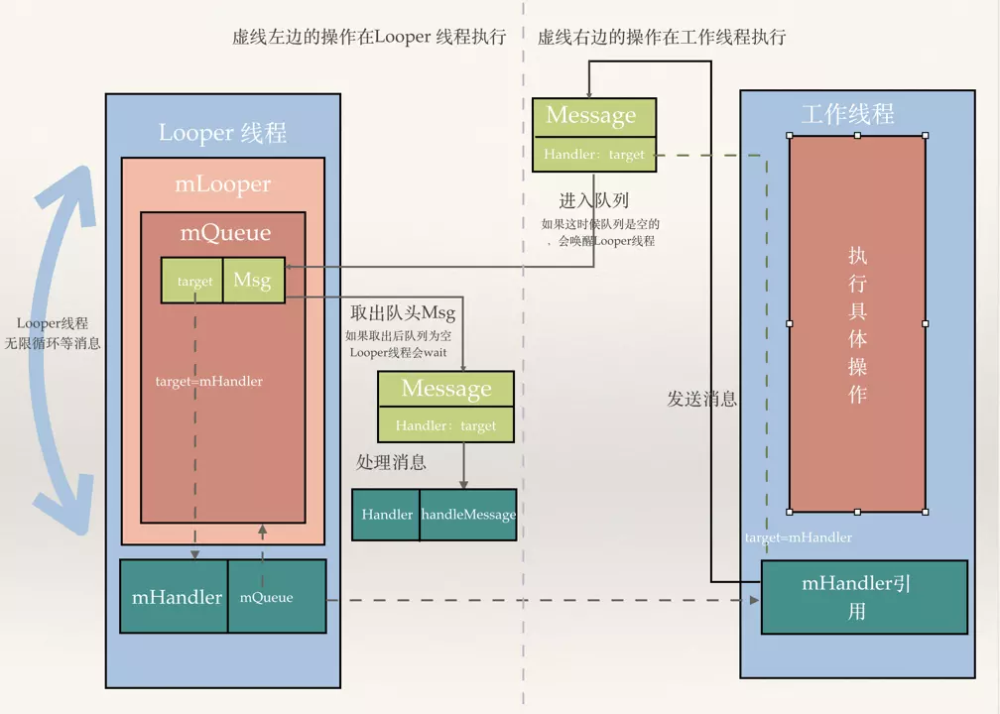

# android 中的线程通信。

####  出现的意义，解决的问题
实现线程间通信，最常见的就是非UI线程想要在延迟操作后更新UI，这个时候Android不建议直接在非UI线程修改，可能造成线程阻塞，导致用户体验太差。 


####  原理，方案
想要实现UI线程，子线程两个线程间通信，子线程需要把消息告诉UI线程，UI线程**主动**去触发消息，处理消息。Android设计封装了一套完整的方案Handler机制。
传统的回调是不行的，回调方法还是运行在调用线程中。

####  内容
主要包含四个结构，一起工作

- Looper：运作消息队列
- MessageQueue：消息队列
- Message：消息
- Handler：消息处理者，传递，分发，处理。



每个线程只能有一个Looper，MessageQueue。  可以有多个handler去发送接收消息。

####  实际应用
1、UI线程的Looper

App启动的代码的入口ActivityThread，这里面会帮我们创建Looper
Looper.prepareMainLooper()
Looper.loop();

```
public static void prepareMainLooper() {
        prepare(false);
        synchronized (Looper.class) {
            if (sMainLooper != null) {
                throw new IllegalStateException("The main Looper has already been prepared.");
            }
            sMainLooper = myLooper();
        }
    }


private static void prepare(boolean quitAllowed) {
         //如果线程的TLS已有数据，则会抛出异常，一个线程只能有一个Looper，prepare不能重复调用。
        if (sThreadLocal.get() != null) {
            throw new RuntimeException("Only one Looper may be created per thread");
        }
        //往线程的TLS插入数据，简单理解相当于map.put(Thread.currentThread(),new Looper(quitAllowed));
        sThreadLocal.set(new Looper(quitAllowed));
    }


private Looper(boolean quitAllowed) {
        mQueue = new MessageQueue(quitAllowed);
        mThread = Thread.currentThread();
}

```

```
public static void loop() {
    final Looper me = myLooper();  //获取TLS存储的Looper对象,获取当前线程的Looper 
    if (me == null) {
        throw new RuntimeException("No Looper; Looper.prepare() wasn't called on this thread.");
    }
 
    final MessageQueue queue = me.mQueue;  //获取Looper对象中的消息队列
    ....

    for (;;) { //主线程开启无限循环模式
        Message msg = queue.next(); //获取队列中的下一条消息，可能会线程阻塞
        if (msg == null) { //没有消息，则退出循环，退出消息循环，那么你的程序也就可以退出了
            return;
        }
        ....
        //分发Message，msg.target 是一个Handler对象，哪个Handler把这个Message发到队列里，
        //这个Message会持有这个Handler的引用，并放到自己的target变量中,这样就可以回调我们重写
        //的handler的handleMessage方法。
        msg.target.dispatchMessage(msg);
        ....
        ....
        msg.recycleUnchecked();  //将Message回收到消息池,下次要用的时候不需要重新创建，obtain()就可以了。
    }
}

```
疑问：：：

1、UI线程一直在这个循环里跳不出来，主线程不会因为Looper.loop()里的死循环卡死吗，那还怎么执行其他的操作呢？

在looper启动后，主线程上执行的任何代码都是被looper从消息队列里取出来执行的。也就是说主线程之后都是通过其他线程给它发消息来实现执行其他操作的。生命周期的回调也是如此的，系统服务ActivityManagerService通过Binder发送IPC调用给APP进程，App进程接到到调用后，通过App进程的Binder线程给主线程的消息队列插入一条消息来实现的。

2、主线程是UI线程和用户交互的线程，优先级应该很高，主线程的死循环一直运行是不是会特别消耗CPU资源吗？App进程的其他线程怎么办？

这基本是一个类似生产者消费者的模型，简单说如果在主线程的MessageQueue没有消息时，就会阻塞在loop的queue.next()方法里，这时候主线程会释放CPU资源进入休眠状态，直到有下个消息进来时候就会唤醒主线程，在2.2 版本以前，这套机制是用我们熟悉的线程的wait和notify 来实现的，之后的版本涉及到Linux pipe/epoll机制，通过往pipe管道写端写入数据来唤醒主线程工作。原理类似于I/O,读写是堵塞的，不占用CPU资源。


2、子线程使用handler
需要调用Looper.prepare()和Looper.loop()创建了消息队列就可以让消息处理在该线程中完成.

3、使用不当Handler内存泄漏
Message会持有一个对Handler的引用，当这个Handler是非静态内部类的时候，又会持有一个对外部类的引用（比如Activity）。如果发送一条延时的Message，由于这个Message会长期存在于队列中，就会导致Handler长期持有对Activity的引用，从而引起视图和资源泄漏。


```
public class HandlerActivity extends BaseActivity {

    @Override
    protected void onCreate(Bundle savedInstanceState) {
        super.onCreate(savedInstanceState);
        setContentView(R.layout.activity_handler);

        handler.sendEmptyMessageDelayed(0, 10 * 60 * 1000);
        finish();
    }

    private Handler handler = new Handler() {
        @Override
        public void handleMessage(Message msg) {
            super.handleMessage(msg);
            // ...
        }
    };
}

```

方案：利用弱引用

```
public class HandlerActivity extends BaseActivity {

    @Bind(R.id.tv_handler)
    TextView tvHandler;

    @Override
    protected void onCreate(Bundle savedInstanceState) {
        super.onCreate(savedInstanceState);
        setContentView(R.layout.activity_handler);
        ButterKnife.bind(this);

        new WeakHandler(this).sendEmptyMessageDelayed(0, 10 * 60 * 1000);
        finish();
    }

    private static class WeakHandler extends Handler {

        WeakReference<HandlerActivity> weakReference;

        public WeakHandler(HandlerActivity activity) {
            weakReference = new WeakReference<HandlerActivity>(activity);
        }

        @Override
        public void handleMessage(Message msg) {
            HandlerActivity activity = weakReference.get();
            if (activity != null && activity.tvHandler != null) {
                activity.tvHandler.setText("收到Handler发送的消息");
            }
        }
    }
}
```

https://www.jianshu.com/p/02962454adf7

https://www.jianshu.com/p/49a70aeb555b


