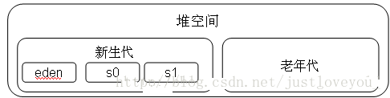
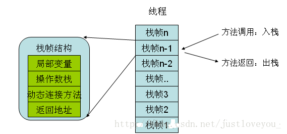

# java内存的分配和回收管理

## java 内存分配
简单的做个分类：线程共享与线程私有

#### 1、Java 堆 

最大的内存区域
存放对象实例，和数组，为了方便垃圾回收，诞生了（分代收集算法）
Java堆还可以分为 新生代 和 老年代区域，新生代还可细分， 运作条件是：在不断的GC过程中对象还能依然存在，就会向老年代转移。
如果在堆中没有内存完成实例分配，并且堆也无法再拓展时，将会抛出 OutOfMemoryError 异常。 

对堆存储效率、安全优化：（线程私有分配缓冲区（TLAB））
缘由：由于对象一般会分配在堆上，而堆是全局共享的。因此在同一时间，可能会有多个线程在堆上申请空间。因此，每次对象分配都必须要进行同步，影响效率了，
方案：TLAB 的存在就是为了解决这个问题：每个线程在Java堆中预先分配一小块内存 TLAB，哪个线程需要分配内存就在自己的TLAB上进行分配，若TLAB用完并分配新的TLAB时，再加同步锁定，这样就大大提升了对象内存分配的效率。特点：小、

#### 2、方法区
存储已被虚拟机加载的类信息、常量、静态变量、即时编译器（Java的字节码-> 机器指令）编译后的代码等数据
运行时常量池是方法区的一部分，用于存放编译期生成的各种 常量
OutOfMemoryError 异常

Java堆 与 方法区的区别： Java堆是 Java代码可及的内存，是留给开发人员使用的；而非堆（Non-Heap）是JVM留给自己用的。

#### 3、程序计数器
为了线程切换后能够恢复到正确的执行位置，每条线程都需要一个独立的程序计数器去记录其正在执行的字节码指令地址
　　因此，程序计数器是线程私有的一块较小的内存空间，其可以看做是当前线程所执行的字节码的行号指示器。如果线程正在执行的是一个 Java 方法，计数器记录的是正在执行的字节码指令的地址；如果正在执行的是 Native 方法，则计数器的值为空。

#### 4、虚拟机栈

虚拟机栈描述的是Java方法执行的内存模型，是线程私有的。每个方法在执行的时候都会创建一个栈帧，用于存储局部变量表、操作数栈、动态链接、方法出口等信息，
而且 每个方法从调用直至完成的过程，对应一个栈帧在虚拟机栈中入栈到出栈的过程。

#### 5、本地方法栈
本地方法栈与Java虚拟机栈非常相似，也是线程私有的，区别是虚拟机栈为虚拟机执行 Java 方法服务，而本地方法栈为虚拟机执行 Native 方法服务。

### 对象在虚拟机中的创建过程

条件：Java堆中内存是否绝对规整

#### 指针碰撞：
如果Java堆中内存绝对规整，所有用过的内存放在一边，空闲内存放在另一边，中间一个指针作为分界点的指示器，那分配内存就仅仅是把那个指针向空闲空间那边挪动一段与对象大小相同的距离。

#### 空闲列表：
如果Java堆中内存并不规整，那么虚拟机就需要维护一个列表，记录哪些内存块是可用的，以便在分配的时候从列表中找到一块足够大的空间划分给对象实例，并更新列表上的记录。

#### 对象在虚拟机中的访问定位
创建对象是为了使用对象，我们的Java程序通过栈上的reference数据来操作堆上的具体对象。在虚拟机规范中，reference类型中只规定了一个指向对象的引用，并没有定义这个引用使用什么方式去定位、访问堆中的对象的具体位置。目前的主流的访问方式有使用句柄访问和直接指针访问两种。

1、句柄访问：Java堆中会划分出一块内存作为句柄池，栈中的reference指向对象的句柄地址，句柄中包含了对象实例数据和类型数据各自的具体地址信息

2、直接指针访问：reference中存储的就是对象地址。

## java 垃圾回收机制

内容：堆 (包括Java堆 和 方法区)是 垃圾回收的主要对象，特别是Java堆。
JVM由于要执行GC而停止了应用程序的执行，并且这种情形会在任何一种GC算法中发生
优化 ：GC优化很多时候就是指减少Stop-the-world发生的时间，从而使系统具有 高吞吐 、低停顿 的特点。

1、那些内存需要回收？
算法发展：
1、 引用计数算法
判断对象的引用数量，任何引用计数为0的对象实例可以被当作垃圾收集。
缺点：很难解决对象之间相互循环引用的问题
2、可达性分析算法
可达性分析算法是通过判断对象的引用链是否可达来决定对象是否可以被回收。

2、什么时候回收？ 
1、标记清除算法

https://blog.csdn.net/justloveyou_/article/details/71189093
https://blog.csdn.net/justloveyou_/article/details/71216049
https://segmentfault.com/a/1190000004606059
https://www.jianshu.com/p/5261a62e4d29