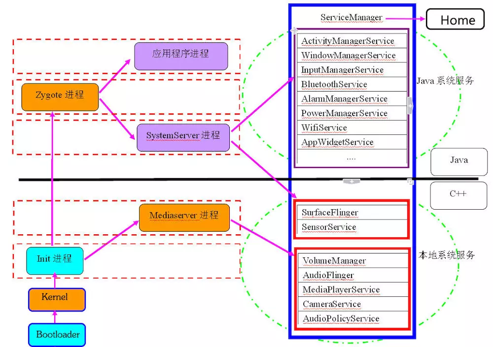
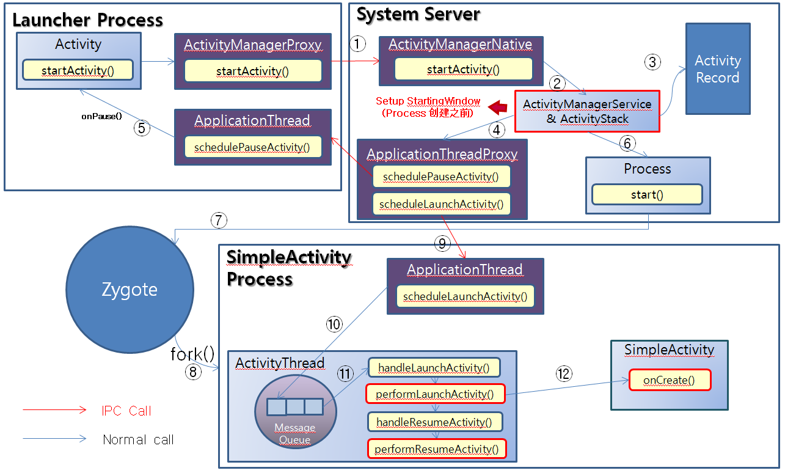
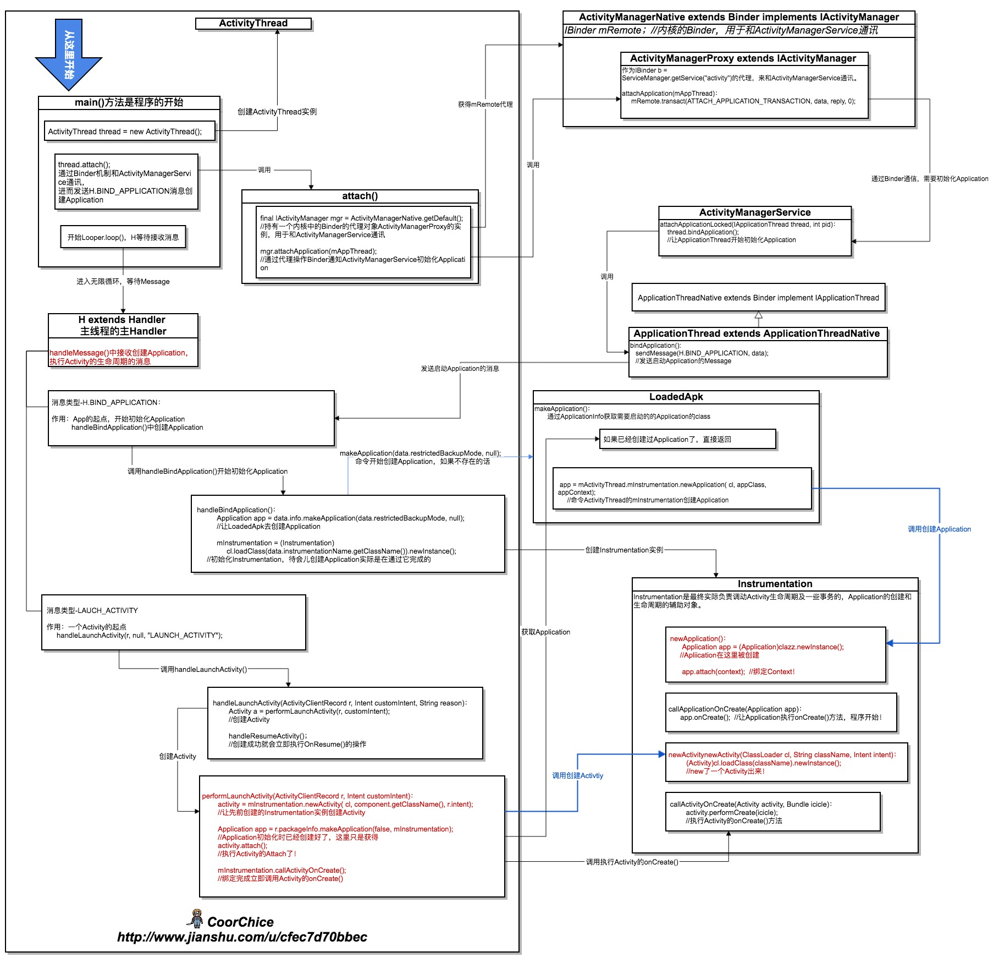

# android 加载过程

#### Android系统启动过程

1. bootloader启动内核和init进程. 
2. init进程分裂出更多名为"daemons(守护进程)"的底层的Linux进程, 诸如android debug deamon, USB deamon等. 这些守护进程处理底层硬件相关的接口.
3. init进程会启动基础进程---"Zygote"，Zygote初始化了第一个VM, 并且预加载了framework和众多App所需要的通用资源
4. Zygote进程开启一个Socket接口来监听请求，一旦收到新的请求, Zygote会基于自身预先加载的VM来孵化出一个新的VM创建一个新的进程.
5. init进程会启动runtime进程，
6. Zygote进程会孵化出一个超级管理进程---System Server. SystemServer会启动所有系统核心服务,如：ActivityManagerService，
7. 启动第一个App进程---Home进程.

#### Android应用启动过程

##### launcher 点击到创建app流程

##### 启动app流程

总结：APP 与 AMS 交互类是C/S模型

1. ActivityManagerService : 独立进程，负责管理维护activity、service。
2. ActivityThread :里面的main()方法为app的入口，app的主线程
3. ApplicationThread :是个Binder对象，连接ActivityThread与ActivityManagerService之间的通信。
4. Instrumentation : 工具类 ，聚集了一些activity、Application相关操作方法（生命周期、创建～～），每一个应用程序只有一个Instrumentation对象，每个Activity内都有一个对该对象的引用。
5. app. 和 AMS 之间都是通过Binder通信，
6. ClassLoader导入相应的Activity类和Application。

---------------------------------------------------------------

##### bootloader
引导程序（bootloader）是在Android操作系统开始运行前的一个小程序，它的主要作用是把系统OS拉起来并运行

##### init进程
Android系统中用户空间的第一个进程，系统级别

##### Zygote进程
Zygote是一个虚拟器进程，预加载以及初始化核心库类，让Dalvik虚拟机共享代码、降低内存占用和启动时间。
所有的应用程序进程以及系统服务进程（SystemServer）都是由Zygote进程孕育（fork）出来的

##### ActivityManagerService
它不但负责启动Activity和Service，还负责管理Activity和Service

##### init.rc

https://blog.csdn.net/luoshengyang/article/details/6689748

https://www.jianshu.com/p/a5532ecc8377

https://www.jianshu.com/p/064136533445