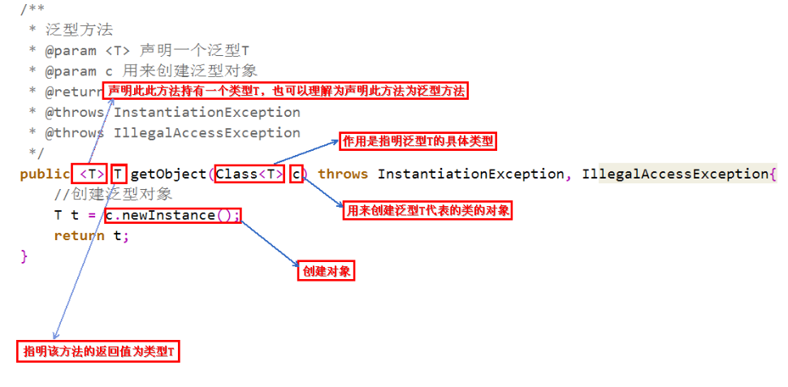
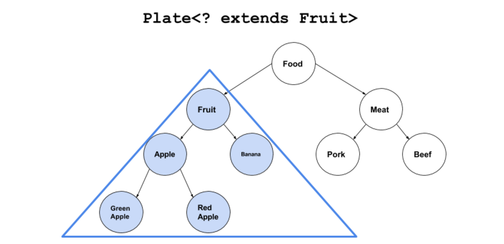
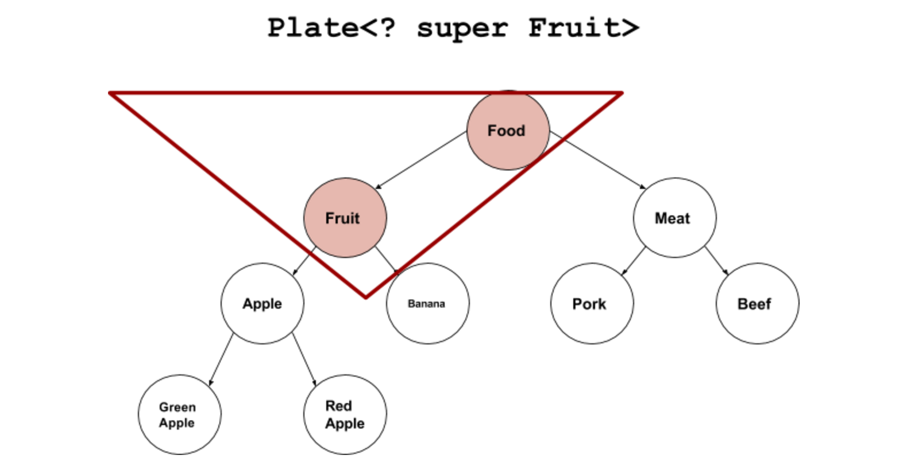
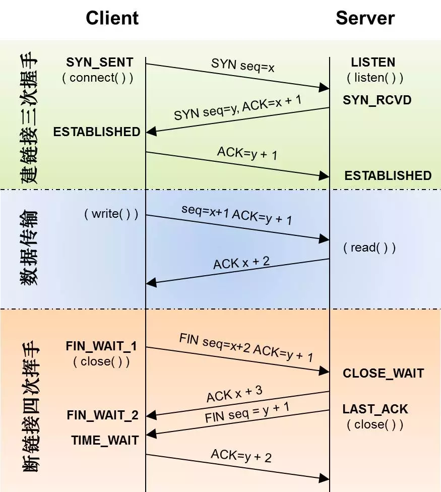

# java基础

#### 方法
原理+小细节

#### 模版
1、决解的问题出现的意义，
2、方案 
3、内容
4、应用
5、项目案例

#### 内容


##### java中==和equals和hashCode的区别
  1. 运算符，方法
  2. 基础数据类型 使用“==”， 对象使用equals 
  3. 不重写equals方法的时候，比较内存地址。
  4. hashCode ：用在散列集合中，提高查找排序效率（HashMap的put方法）
  
##### int、char、long各占多少字节数
Byte：1 ，
char：2  short：2 ，
int：4 
long：8

##### 面向对象三个特征
1. 继承
2. 封装
3. 多态 （同一调用的不同实现， 继承、重写、父类引用指向子类对象，结偶、替换、扩展） 

##### 什么是内部类？内部类的作用
1. 一个类的定义放在另一个类的定义内部
2. 
成员内部类
静态内部类
匿名内部类

好处：多继承（每个内部类都能独立的继承一个接口的实现） ，还装饰模式也可以打破多继承问题


##### 抽象类和接口区别
都不能被实例化，
接口：抽象方法的集合，不存在方法的实现
抽象类：捕捉子类的通用特性，与正常Java类相比除了不能实例化抽象类之外，它和普通Java类没有任何区别(有构造器,存在方法的实现)

##### 泛型
出现的意义：将类型由原来的具体的类型参数化,类似于方法中的变量参数，此时类型也定义成参数形式（可以称之为类型形参），然后在使用/调用时传入具体的类型（类型实参）<br/>
方法：使用 <T> 等形式。<br/>
内容：

1. 泛型类～～
2. 泛型接口～～
3. 泛型方法
首先在public与返回值之间的<T>必不可少


4. 泛型通配符
出现的意义：部分情况我们需要行参可以传入父子类，是不行的，原因就是：容器里装的东西之间有继承关系，但容器之间是没有继承关系的，为了解决这个问题，诞生通配符

上界通配符：<? extends T>，传入的参数可以是T的子类

下界通配符：<? super T>，传入的参数可以是T的父类



泛型只在编译阶段有效:在编译过程中，正确检验泛型结果后，会将泛型的相关信息擦出，并且在对象进入和离开方法的边界处添加类型检查和类型转换的方法。也就是说，泛型信息不会进入到运行时阶段。

##### 进程和线程的区别
独立的地址空间、崩溃影响
CPU调度和分派的基本单位

##### final，finally，finalize的区别
final：改动限制修饰符，可用于成员、方法、类。不可改变、重写、继承
finally：try\catch，总会执行
finalize：垃圾回收

##### 序列化
解决的问题：持久化储存、网络中传递。
序列化：对象 -》字节
反序列化：字节 -〉对象
ObjectOutputStream\ObjectInputStream
用法：

1. Serializable：java自带，最常用方便（ID、Transient）
2. Parcelable：Android特有，就是Android觉得Serializable效率低，自己写一套。常用在Intent传值
原理：Parcelable方式的实现原理是将一个完整的对象进行分解（Parcel）， 而分解后的每一部分都是Intent所支持的数据类型，这样也就实现传递对象的功能了

##### 为什么握手要“3”次

为了防止已失效的连接请求报文段突然又传送到了服务端，因而产生错误。

“已失效的连接请求报文段”的产生在这样一种情况下：client发出的第一个连接请求报文段并没有丢失，而是在某个网络结点长时间的滞留了，以致延误到连接释放以后的某个时间才到达server。本来这是一个早已失效的报文段。但server收到此失效的连接请求报文段后，就误认为是client再次发出的一个新的连接请求。于是就向client发出确认报文段，同意建立连接。假设不采用“三次握手”，那么只要server发出确认，新的连接就建立了。由于现在client并没有发出建立连接的请求，因此不会理睬server的确认，也不会向server发送数据。但server却以为新的运输连接已经建立，并一直等待client发来数据。这样，server的很多资源就白白浪费掉了。采用“三次握手”的办法可以防止上述现象发生

##### 为什么挥手要"4"次
TCP协议是一种面向连接的、可靠的、基于字节流的运输层通信协议。TCP是全双工模式，这就意味着，当客户端发起FIN报文段时，只表示客户端已经已经没有数据要发送了，客户端告诉服务器，它的数据已经全部发送完毕了，但是此时客户端还是可以接受服务器的数据；当服务器返回ACK报文段是时，表示它已经知道客户端没有数据发送了，但是服务器还是可以发送数据到客户端；当服务器也发送了FIN报文时，这时候就是表示服务器也没有数据要发送给客户端了，之后就可以愉快地中断这次TCP连接

##### 为什么要用HTTPS
弥补的HTTP的安全缺陷
1. 通信使用明文(不加密)，内容可能被窃听
2. 不验证通讯方的身分，任何人都坑你发送请求，不管对方是谁都返回相应
3. 无法证明报文的完整性，可能会遭到篡改，即没有办法确认发出的请求/相应前后一致。（抓包工具）

##### string 转换成 integer的方式及原理
1. 符号（-+）判断，根据ASCII确定范围，在对比值，
2. 循环遍历确定每个字符的十进制值（根据ASCII值）
3. 拼接

##### ThreadLocal
1. 通常情况下，我们创建的变量是可以被任何一个线程访问并修改的。而使用ThreadLocal创建的变量只能被当前线程访问，其他线程则无法访问和修改。


##### 排序
1、选择排序
首先在未排序序列中找到最小（大）元素，存放到排序序列的起始位置（交换位置），然后再从剩余未排序元素中继续寻找最小（大）元素，然后放到已排序序列的末尾。

```
 /**
     * 选择
     *
     * @param arr
     */
    private void sort1(int[] arr) {
        int i, j, min, temp, leng = arr.length;
        for (i = 0; i < leng - 1; i++) {
            min = i;
            for (j = i + 1; j < leng; j++) {
                if (arr[min] > arr[j]) {
                    min = j;
                }
            }
            temp = arr[min];
            arr[min] = arr[i];
            arr[i] = temp;
        }
    }
    
```

细节：两次for循环的模式：for(起点；终点；++)，
     记录角标，最后交互数据。

2、冒泡
从左到右不断交换相邻逆序的元素，在一轮的循环之后，可以让未排序的最大元素上浮到右侧。

```
public static void bubbleSort(int[] arr) {
    int i, temp, len = arr.length;
    boolean changed;
    do {
      changed = false;
      len-=1;
      for (i = 0; i < len; i++) {
        if (arr[i] > arr[i + 1]) {
          temp = arr[i];
          arr[i] = arr[i + 1];
          arr[i + 1] = temp;
          changed = true;
        }
      }
    } while (changed);
  }
```

细节：终止条件为一道遍历下来，没有交换位置的了。

3、插入
故事：有个在线去了个排队号的顾客，现在来到了餐厅已经排好的队伍前， 怎么实现找到自己的位置。

它的工作原理是通过构建有序序列，对于未排序数据，在已排序序列中从后向前扫描，找到相应位置并插入。

```
  /**
     * 擦入
     *
     * @param arr
     */
    private void sort3(int[] arr) {
        int i, j, temp, leng = arr.length;
        for (i = 1; i < leng; i++) {//无须
            temp = arr[i];
            j = i - 1;//从有序未开始比较
            while (j >= 0 && arr[j] < temp) {//有序
                arr[j + 1] = arr[j];//后靠～～～
                j--;
            }
            arr[j + 1] = temp;
        }
    }

```

