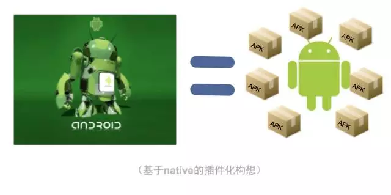

# Android中的插件化

#### 区分插件化和热修复：
技术|目的|难易度
---|:--:|---:
插件化|实现功能模块独立出来加载|相对简单
热修复|修复bug|实现复杂

#### 含义：
不必再像原来一样把所有的内容都放在一个apk中，分为宿主apk、插件apk。

宿主： 就是当前运行的APP

插件： 相对于插件化技术来说，就是要加载运行的apk类文件

#### 优点：
1. 热部署：需要什么功能加载什么功能
2. 模块化
3. 不发版本上新功能
4. 宿主小
5. 独立开发独立模块
6. bug修复（不建议）～～～～

#### 方案：
- 业务上：应用在运行的时候动态的加载一些可替换的执行文件实现一些特定的功能，
- 代码上：通过ClassLoader类加载器加载外部dex文件（即插件）来实现一些特定的功能。
- 分两块：1、Java文件加载，2、资源文件加载
- 难点：1、加载资源文件，2、加载Android四大组件，
Fragment代替Activity，这样可以最大限度得避开“无法注册新组件的限制”。

#### 核心内容
- ClassLoader类加载器：
虚拟机通过ClassLoader加载Jar文件并执行里面的代码，Android应用类似于Java程序，虚拟机换成了Dalvik/ART，而Jar换成了Dex

- Java反射详解：
- 插件中的R资源：

#### 应用：

#### 开源框架学习：
Dynamic-load-apk
DroidPlugin

#### 非官方支持

参考：

https://www.jianshu.com/p/704cac3eb13d

http://lruheng.com/2017/07/01/Android%E6%8F%92%E4%BB%B6%E5%8C%96%E5%85%A5%E9%97%A8%E6%8C%87%E5%8D%97/

https://tech.meituan.com/android_hydra.html

https://segmentfault.com/a/1190000004062866