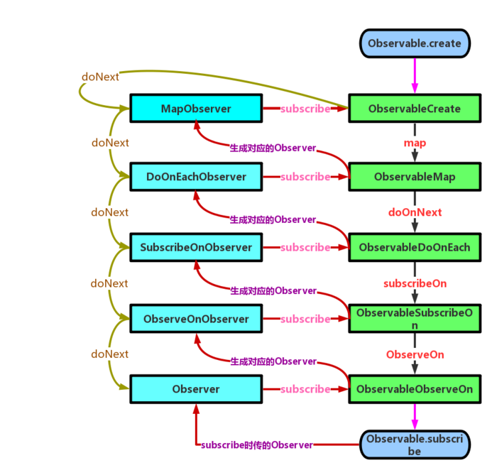

# Rxjava 原理

#### Rxjava 原理

一个简单的订阅流程：
       核心思想观察者模式，被观察者拥有观察者对象，订阅的时候调用观察者的方法。

详细的实现：在订阅的时候调用被观察者的抽象真实订阅方法（subscribeActual），参数传入观察者对象，创建的被观察者对象里面实现了真实订阅方法，并在里面调用了观察者对象的方法。

订阅的时候发生的事情：

 1. 订阅其实就是调用被观察者实现的抽象真实订阅方法.
 2. 将观察者对象传给被观察者.
 3. 调用观察者的方法.
 
map 操作符：
    map操作符做的事情：简单逻辑就是，找到被观察者和观察者，实现中间订阅。
    
   1. 传入上游的被观察者对象，
   2. 封装下游的观察者对象成（MapObserver），MapObserver里面实现了onNext方法，onNext方法的传入参数为实现的Function对象，并调用Function对象的数据转换方法，将变换后的数据在传给下游观察者。
   3. 在订阅的时候，让上游的Observable订阅封装的MapObserver。

数据流：从上到下，依次onNext传递。
订阅：从下到上，依次订阅。
     
#### 第二阶段
##### 价值，意义：
将业务化繁为简，改善流程。（各种嵌套，for循环，～～）

##### 核心方案：
响应式编程，观察者模式，装饰者模式。

##### 内容（顾客去饭店）
（1）简单流程
创建Observable,抽象类，实现的是子类， 参数为两者枢纽ObservableOnSubscribe.
创建Observer。
联通靠：Observable.subscribe,1、包装Observer（装饰者），2、调用Observer的onSubscribe, 3、ObservableOnSubscribe中间枢纽工作，开始调用Observer的方法，传数据（中间键）。
列子：顾客去饭店吃饭。（饭店，厨子，服务员，顾客）

流线图：

总结：

1. 创建任务链，每一步都会返回对应的Observable对象，实现不同的订阅方法。
2. 逆向逐级订阅。每一步都会生成对应的Observer对上一步生成的Observable进行订阅
3. 执行任务链。执行任务链之后，每一步都会通知对应的Observer，从而完成整调任务链。

（2）线程切换（装饰者模式对功能的扩展）
要实现线程切换，就要将ObservableOnSubscribe（厨子）调用subscribe（）（订阅操作）放在相关线程。
Rx流程：将它封装进runnable，传入线程调度器。

（3）ObserverOn
ObserveOn会用一个queue保存上一级传下来的数据，然后通过scheduler创建一个worker，提交数据，并将任务执行在worker设置的线程中

http://rkhcy.github.io/2017/12/13/%E5%9B%BE%E8%A7%A3RxJava2(%E4%B8%80)/#more

