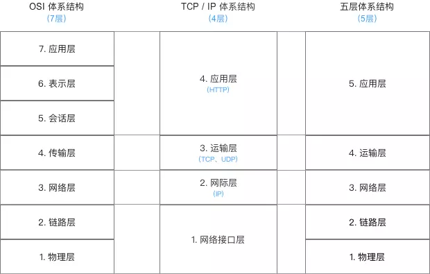
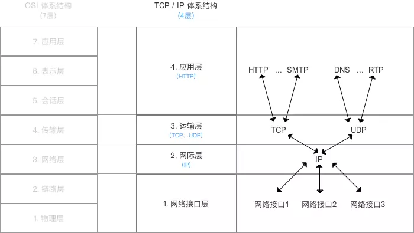
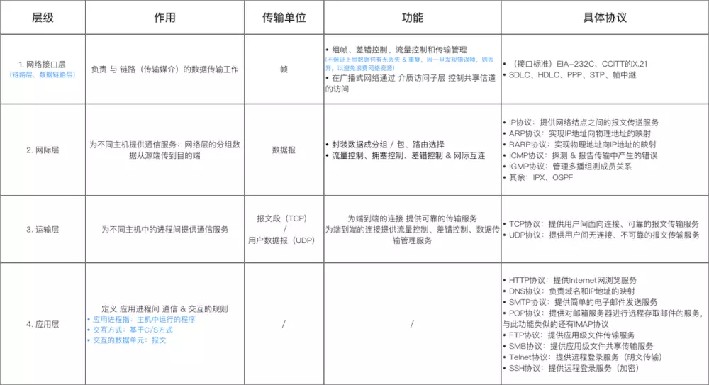
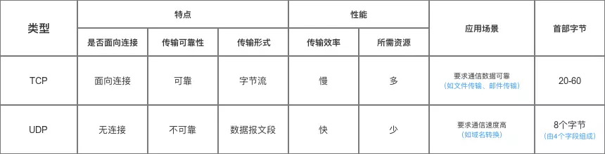
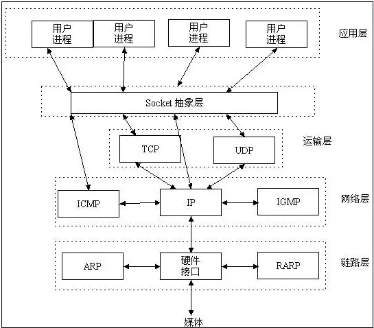

# Socket理解与使用 
#### 各种协议出现的意义
比如说：数据目的地如何规定，发送的数据如何包装，放到哪里？这中间就需要有各种协议。大家都使用这个协议，统一成一个规范，这样符合这个规范的各种设备之间能够进行兼容性的通信。

#### 计算机网络体系结构

- 低三层为通信子网，负责数据传输
- 高三层为资源子网，相当于计算机系统，完成数据处理
- 传输层承上启下

##### 最常用的TCP / IP的体系结构

细节

##### tcp与udp

##### 握手分手

#### Socket

#### Socket 与 Http 对比

- 一个是传输层，一个是应用层协议，没有可比性
- 默认的Http里面封装了下面几层的使用
- http 单向请求 ， Socket 双向。

#### 应用 

项目实践

https://www.jianshu.com/p/089fb79e308b

https://www.viseator.com/2017/05/11/android_lan_messages/

