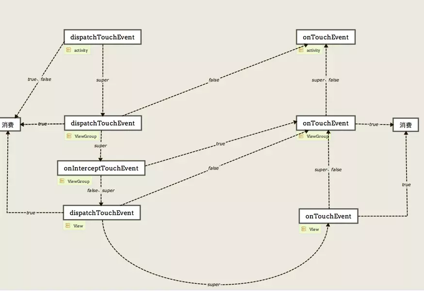

针对简历整理面试资料

#### 自我介绍：
1. 地点：上海大都市
2. 专业：软件技术 、课程  ----》 Android开发
3. 家庭：程序员
4. 工作： 第一家 ：资深，广度。    第二家：大厂经历（携程、阿里技术体系）、深度。
5. 哥哥在菲律宾工作。

#### 叙事格式：
1. 为什么诞生，出现的意义
2. 方案
3. 简述内容
4. 实际使用。

#### 技术点
##### MVP：
- 以前一个activity搞定所有事，视图、数据、业务，臃肿。急需节藕抽离。
- 使用MVP模式，将业务逻辑从activity里面抽出来，
- M = 实体模型 ， V = 视图 ， Presenter = 业务逻辑
实现：将业务逻辑和视图逻辑抽象到接口中，Presenter将二者连接起来，
跟以前最大的区别就是 V 和 M 不会直接沟通，通过Presenter来连接。
- 实际情况：如果简单的页面没必要， 复杂的需要（维护、需要多建立文件）。
注意：Model：业务逻辑和实体模型。

待续～～～～～～
##### Rxjava ： 场景：业务逻辑复杂，依然简洁
- 一些复杂的逻辑，if 、for 一层又一层，现场切换handler麻烦。Rxjava就完美解决这些问题。
- 响应式编程，按照事件的顺序依次撸代码。
- 核心： 响应式编程，观察者模式，装饰者模式。
实现：观察者模式，被观察者拥有观察者对象，订阅的时候调用观察者的方法
订阅：从下游往上游进行订阅，数据的传递和处理顺序是由上到下的。
- 三个分析。 1、简单的订阅流程，2、中间订阅，3、线程切换。
- subscribeOn只发生一次，observeOn可以使用多次

##### Retrofit ：  Request ---- Response
- 可以配合Rxjava, 简化流程、高效、兼容性强
- 注解、动态代理得到网络请求接口实例上所有注解

App应用程序通过 Retrofit 请求网络，实际上是使用 Retrofit 接口层封装请求参数、Header、Url 等信息，之后由 OkHttp 完成后续的请求操作
在服务端返回数据之后，OkHttp 将原始的结果交给 Retrofit，Retrofit根据用户的需求对结果进行解析

通过解析 网络请求接口的注解 配置 网络请求参数
通过 动态代理 生成 网络请求对象
通过 网络请求适配器 将 网络请求对象 进行平台适配

通过 网络请求执行器 发送网络请求
通过 数据转换器 解析服务器返回的数据
通过 回调执行器 切换线程（子线程 ->>主线程）
用户在主线程处理返回结果

##### Glide ：
对比Google推荐、更高效的缓存策略、多样化媒体加载

##### Tinker：
- 小问题发布版，用户会觉的烦。
- 发布补丁，不用升级更新应用。
- 简单原理 在编译时通过新旧两个Dex生成差异path.dex。在运行时，将差异patch.dex重新跟原始安装包的旧Dex还原为新的Dex

1. 耗费时间与内存：单独进程
2. DexDiff
3. Tinker对补丁版本管理
4. 多进程初始化注意

实际应用：多进程应用注意，只需要在主进程初始化就行。

##### Hybrid：
- 解决很多问题，如跨平台、bug修复、开发成本、快速迭代
- H5前端和native交互协议

Js - native addJavascriptInterface

Native - js :loadUrl\evaluateJavascript页面刷新

定义协议 restful ，shouldOverrideUrlLoading

- 定义协议文档就像定义接口一样。
这里分了几大类：UI（刷新、加载圈、title）、pay、定位、多媒体、、、、

##### Sql:
- SQLiteDatabase  SQLiteOpenHelper  
- 扩展Room

##### 组件化：
- 共用业务组件 美团 - 美团外卖   场景分析
- 分git仓库建Library Model  外壳 ，submodule构建。
- 实际操作，  支付 会员。

##### Robotium 
黑盒自动化测试，它提供了模拟各种手势操作（点击、长按、滑动等）、查找和断言机制的API
每个activity写一个用例文件。边写好了 放在服务上，定时运行 jenkins 定时任务

##### Jmeter
刚进公司 支付，公司在情人节前需要对支付进行压力测试，以备不时之需。 主动出击
压测工具

##### Leakcanary  泄露工具
##### Blockcanary  卡顿工具
##### Chuck  日志工具

##### 美易点 多进程
- 100多张表  
  1. 订单表：订单头 （订单汇总信息）、订单点菜单序 、商品明细 、支付头、付款明细、每道菜品的支付明细 
  2. 菜品：菜品、规格、要求、做法、菜品分类、折扣、套餐
  3. 用户： 、、、

- 多进程
前端进程、业务中心、打印、监控
包活：bindService两个服务互拉（ServiceConnection的 onServiceDisconnected 唤醒）、
AlarmManager
通信：Binder （用户空间、内核空间）:   队列并发AIDL.不需要并发Messenger
扩展：
插件话的使用、

##### Socket的应用：
全双工 站点 与 业务中心 需要发求情
ServerSocket
线程处理
心跳：资源管理

#### 自定义View
1. 构造方法自定义属性
   res/values/attrs.xml
2. 测量OnMeasure['meʒə]
  - 32字节，前两模式后30长度
  - match_parent--->EXACTLY ：利用父View给我们提供的所有剩余空间 
  - wrap_content--->AT_MOST ：不超过父空间，根据需求设置
  - 固定尺寸--->EXACTLY ： 
  
3. OnLayout (ViewGroup)
   layout(int l, int t, int r, int b) 
4. OnDraw[drɔ:] 
  Canvas 、 Paint
5. 事件分发
  - Activity -> ViewGroup -> View
  - dispatchTouchEvent -> onInterceptTouchEvent(ViewGroup) -> onTouchEvent
  - 一个正常的流程（super）是走完整的流程，这时候业务情况调整 ，返回true消费掉事件不再传递，返回false跟super一样（除了Activity的dispatchTouchEvent）。

6. 优化：卡顿、内存等情况
   Android studio的profiler监控CPU、内存等情况。开发模式GPU渲染情况

实际情况：自己写需要大量时间，需要迭代修复大量未知问题。GitHub上找类似高fork、star的开源项目，根据业务改源码。  

#### 描述一个遇到的问题 ，怎么解决的～～～
百度人脸识别：部分手机脸变形，比较排斥提供的库，要求高

开始 ：分析原因，可能是 View布局问题，排查不是，没办法看源码，发现使用的关键类：Camera，SurfaceView ，surfaceview 用于呈现Camera的即时画面，查看重要方法，定位应该是设置参数出问题，Google后发现camera在设置setParameters的时候需要找到一个最佳预览比例， 这个比例不同的机型提供不一致，定位到源码设置参数位置，发现源码里面有个最大限，当获取到系统的预览比例列表的时候会排出大于最大限制的值，  这里应该是针对前一两年的机型，对新出来的部分机型支持不太友好，后放大限制，完美解决。

