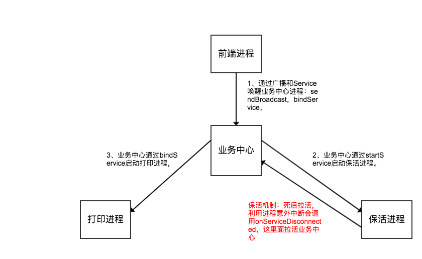
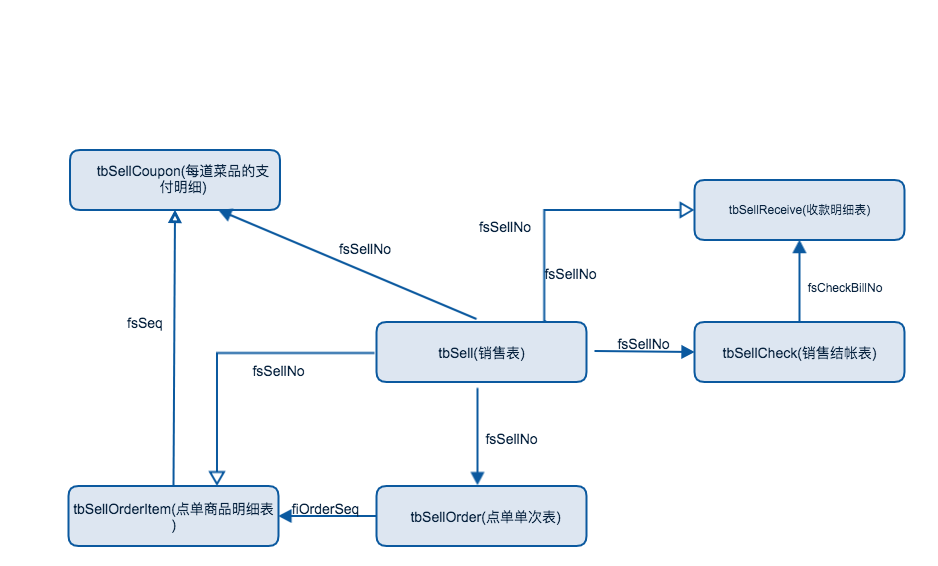

# 项目

### 项目架构

### 表设计
- 第一范式：1NF是对属性的原子性约束，要求属性具有原子性，不可再分解； 
- 第二范式：2NF是对记录的惟一性约束，要求记录有惟一标识，即实体的惟一性； 
- 第三范式：3NF是对字段冗余性的约束，即任何字段不能由其他字段派生出来，它要求字段没有冗余。 

1. 设计表结构，使用到了**面向对象**思想，一个对象一张表
2. n-n 可以转换成 2个1-n。

#### 订单

- tbSell：订单头 （订单汇总信息）

- tbSellOrder：订单点菜单序 （点单单次信息）

- tbSellOrderItem：订单商品明细 （菜品信息）

- tbSellCheck：支付头 

- tbSellReceive：付款明细

- tbSellCoupon：每道菜品的支付明细 （fsSeq：菜品下单唯一序号）

#### 菜品

#### 用户

#### Socket长链接 、端链接

### 插件化

